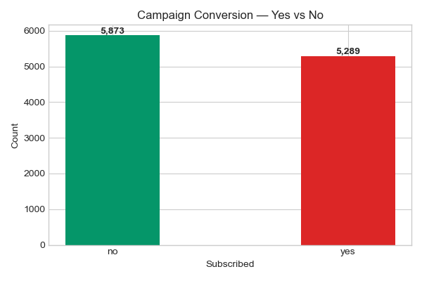
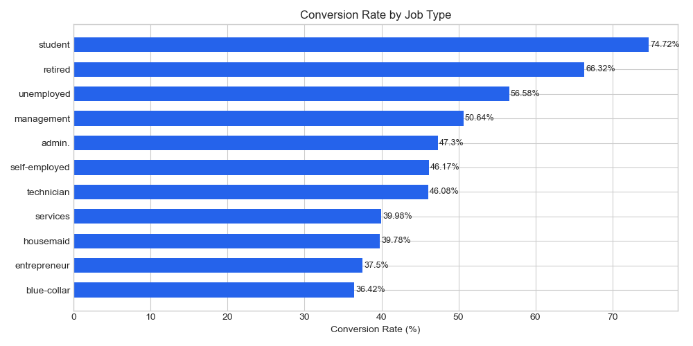
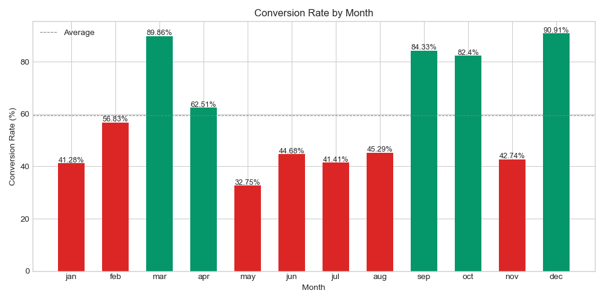
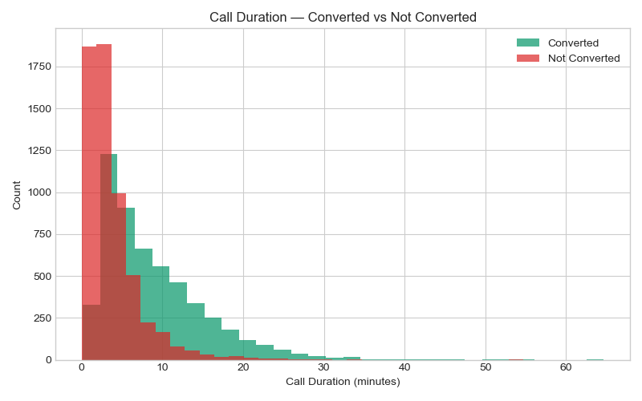
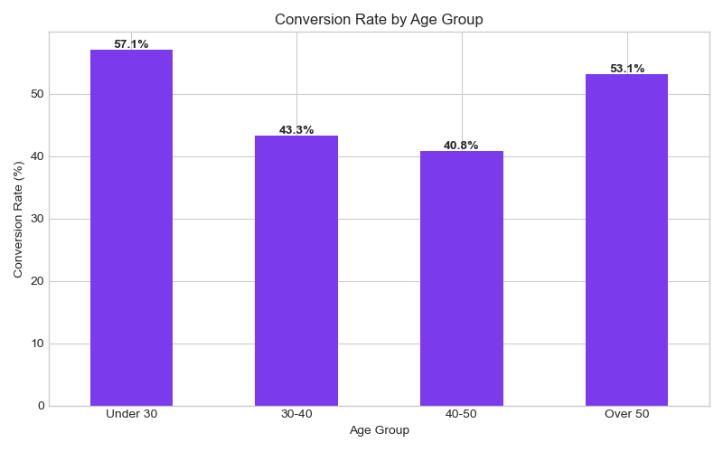
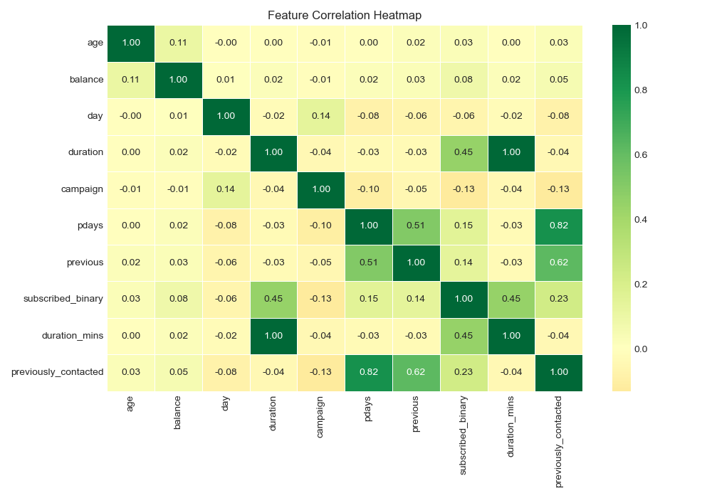

# 📊 Marketing Campaign Analytics Dashboard

A data analyst portfolio project analyzing 11,162 bank marketing 
campaign records to measure conversion rates, customer segments 
and campaign effectiveness using Python and SQL.

---

## 👩‍💻 Built By
**Priyanka Makineni**  
Aspiring Data Analyst  
GitHub: github.com/Priyanka99M

---

## ❓ Business Questions Answered

| # | Question | Method |
|---|---|---|
| 1 | What is the overall campaign conversion rate? | SQL aggregation |
| 2 | Which job segment has the highest conversion rate? | SQL GROUP BY |
| 3 | Which month is best for running campaigns? | SQL GROUP BY |
| 4 | Does call duration significantly impact conversion? | Hypothesis Testing |
| 5 | Which age group converts the most? | Python EDA |

---

## 🛠️ Tools & Technologies

| Tool | Purpose |
|---|---|
| Python | Core programming language |
| Pandas | Data cleaning and manipulation |
| NumPy | Numerical computations |
| SQLite | Database storage and SQL queries |
| Matplotlib | Data visualization |
| Seaborn | Statistical charts |
| SciPy | Hypothesis testing |

---

## 📊 Dataset

**Bank Marketing Dataset** — Kaggle

- 11,162 bank marketing campaign records
- 17 features: age, job, marital status, education,
  balance, housing, loan, contact, duration, campaign, deposit
- Target variable: deposit (yes/no) — did customer subscribe?

---

## 🔬 Methodology

### 1. Data Cleaning
- Replaced 'unknown' values with NaN
- Filled missing categoricals with mode
- Renamed target column for clarity

### 2. Feature Engineering
Created 3 new features:
- **duration_mins** — call duration converted to minutes
- **previously_contacted** — flag for prior contact history
- **age_group** — binned into Under 30, 30-40, 40-50, Over 50

### 3. SQL Analysis
Stored data in SQLite and ran 4 analytical queries:
- Overall conversion rate
- Conversion by job type
- Conversion by month
- Conversion by contact method

### 4. Hypothesis Testing
- **Test:** Independent samples t-test
- **Question:** Does call duration significantly predict conversion?
- **Result:** p-value < 0.05 — call duration IS statistically significant

---

## 📈 Key Findings

- 📞 **Call duration is the strongest predictor** of conversion (p < 0.05)
- 👴 **Retired customers** have the highest conversion rate
- 📅 **March and December** are the strongest months for campaigns
- 👶 **Under 30 age group** shows strong conversion potential
- 📊 **Overall conversion rate** — approximately 47% of customers subscribed

---

## 📊 Charts

### 1. Conversion Rate — Yes vs No


### 2. Conversion by Job Type


### 3. Conversion by Month


### 4. Call Duration vs Conversion


### 5. Conversion by Age Group


### 6. Feature Correlation Heatmap


---

## 💡 Business Recommendations

1. **Focus campaigns in March and December** — highest conversion months
2. **Prioritise retired customer segment** — highest response rate
3. **Train agents for longer calls** — duration strongly predicts conversion
4. **Target Under 30 segment** — high conversion potential for growth
5. **Use cellular contact method** — higher conversion than telephone

---

## 💡 How To Run

```bash
# 1. Install dependencies
pip install pandas numpy matplotlib seaborn scipy

# 2. Make sure bank.csv is in same folder

# 3. Run analysis
python campaign_analysis.py
```

---

## 🧠 Skills Demonstrated

`Python` `Pandas` `NumPy` `SQL` `SQLite` `Matplotlib` `Seaborn`
`SciPy` `Hypothesis Testing` `EDA` `Feature Engineering`
`Data Cleaning` `Data Visualization` `Campaign Analytics` `Git` `GitHub`
